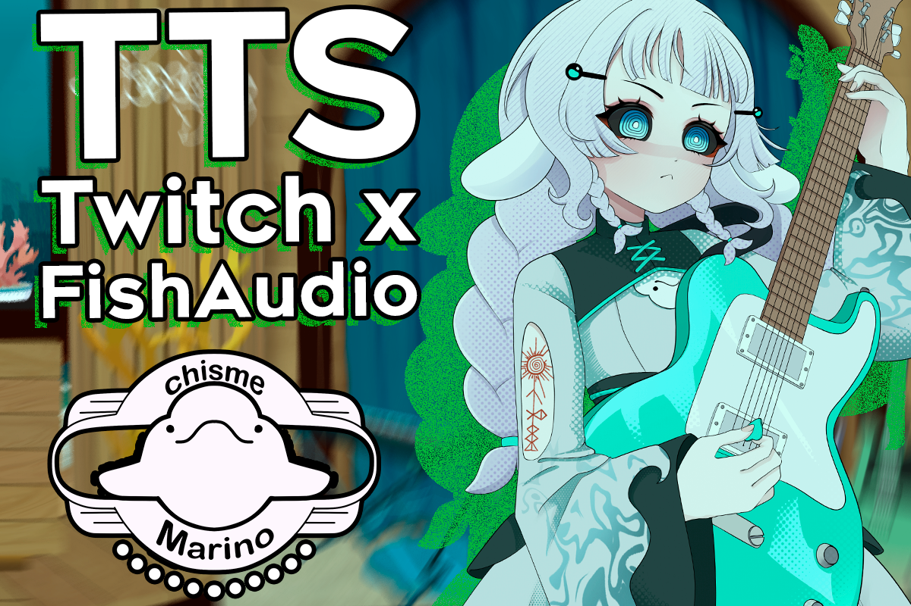

# BOT TTS para Twitch


**Desarrollado por: HexolST**

Este proyecto consiste en un bot de Text-to-Speech (TTS) para Twitch, desarrollado en Python. Su objetivo es permitir que los mensajes enviados por los espectadores puedan ser convertidos en voz y reproducidos durante una transmisión.

## ¿Por qué se creó?

El proyecto nace como una alternativa gratuita para utilizar servicios de generación de voz, evitando depender exclusivamente de soluciones de pago. Actualmente, el bot está pensado para funcionar utilizando la API gratuita de FishAudio y puede integrarse con Streamer.bot.

## ¿Cómo funciona?

Este programa lee en voz alta los mensajes de tu chat de Twitch. Se puede activar escribiendo `!s` en el chat, o canjeando puntos de canal (si configurás Streamer.bot).

No hace falta saber programar para instalarlo, pero sí hay que seguir estos pasos con calma, uno por uno. No te preocupes, solo debés hacerlo una vez.

## Unas palabras

No soy un experto en programación ni nada por el estilo. Este proyecto nació simplemente como una alternativa gratuita para disfrutar de estas herramientas y experimentar con ellas.

Revisé y probé personalmente el código, pero sé que hay bastante espacio para mejorar. Si encontrás algún error, tenés alguna sugerencia o querés modificarlo, ¡adelante! Si alguien quiere tomar este proyecto como base y crear su propia versión mejorada, será totalmente bienvenido.

---

## Requisitos

- Windows 10 u 11
- Python **3.11.9** (el manual está basado en esta versión, no está confirmado si funciona en otras)
- Una cuenta de Twitch (de streamer)
- Una cuenta en fish.audio
- Streamer.bot instalado y conectado a tu canal (opcional, solo si querés que funcione con canjes de puntos)

## 1. Instalar Python

1. Anda a [https://www.python.org/downloads/](https://www.python.org/downloads/) y descargá **Python 3.11.9** (los links de versiones antiguas están más abajo en la página).
2. **Al instalarlo**: marca la casilla **"Add python.exe to PATH"** — esto es importante para que Windows encuentre Python sin problemas. Está justo antes de "Install".
3. Para confirmar que quedó bien instalado, busca "cmd" en el menú de inicio y escribe en la terminal:
   ```
   python --version
   ```
   (debería mostrarte tu número de versión)

**Extra para evitar errores**: en el buscador de tu PC escribe "alias de ejecución de aplicaciones" y desactiva las entradas que digan `python.exe` y `python3.exe`. Esto evita el error de "Python no encontrado, ejecutar sin argumentos" que a veces aparece aunque Python este bien instalado.

## 2. Instalar Visual Studio Code (opcional, pero recomendadísimo)

Descargalo de [https://code.visualstudio.com/](https://code.visualstudio.com/) — es el editor donde vas a poder ver y tocar los archivos de configuración fácilmente. Solo saltealo si ya sabés lo que hacés.

## 3. Preparar la carpeta del proyecto

1. Organiza la carpeta descomprimida donde quieras (por ejemplo, en "Documentos").
   > Hipótesis no confirmada: guardar los archivos en "Descargas" podría no funcionar bien — se recomienda igual poner la carpeta en un lugar cómodo, fuera de esa carpeta.
2. Abre la carpeta en VS Code (**Archivo → Abrir carpeta...**).
3. Abre una nueva terminal en VS Code (**Terminal → Nueva Terminal**).

## 4. Crear el entorno virtual e instalar las librerías

En la terminal, escribí uno por uno:

```
python -m venv venv
```
```
venv\Scripts\activate
```

Deberías ver `(venv)` al inicio de la línea.

**(Opcional)** Solo si te aparece un error de "ejecución de scripts deshabilitada", ejecuta esto una sola vez:
```
Set-ExecutionPolicy -Scope CurrentUser -ExecutionPolicy RemoteSigned
```
Una vez hecho eso, reinicia VS Code y reintenta los pasos anteriores.

```
pip install -r requirements.txt
```

Con esto ya se instalan todas las librerías necesarias de una sola vez.

## 5. Generar tu token de Twitch

1. Anda a [https://twitchtokengenerator.com/](https://twitchtokengenerator.com/)
2. Elege **"Bot Chat Token"**.
3. Inicia sesión con tu cuenta de Twitch y autoriza los permisos.
4. Copia el **Access Token** y guardalo en un lugar a mano.

## 6. Conseguir tu API key de Fish Audio

1. Entra a tu cuenta en [fish.audio](https://fish.audio/es/) → iniciá sesión → **Desarrollador** → **API Keys**.
2. Genera una clave nueva y copiala (podés llamarla como quieras, solo necesitás el código secreto de la API).

## 7. Crear tu archivo de credenciales

1. Copia el archivo `.env.example` de la carpeta descargada y renombra la copia a `.env` (sin nombre ni extensión adicional).
2. Abrilo en VS Code y completa con tus datos reales:
   ```
   TWITCH_TOKEN=oauth:el_token_que_conseguimos_de_twitch
   TWITCH_CHANNEL=tu_nombre_de_canal
   FISH_API_KEY=tu_api_de_fishaudio
   ```
   (sin comillas, sin espacios)
3. Guardalo (`Ctrl+S` en VS Code).

**Importante**: nunca compartas este archivo `.env` con nadie — son tus credenciales privadas.

## 8. Configurar `config.json`

Abre `config.json` (en VS Code) y ajustá lo que quieras:

- `command`: la palabra que activa el TTS (por defecto `!s`)
- `cooldown_seconds`: segundos de espera entre usos por persona
- `max_message_length`: cuántos caracteres como máximo se leen
- `allowed_users` / `blocked_users`: listas de usuarios permitidos o bloqueados (dejalas vacías `[]` para no restringir)
- `subs_only`: `true` si solo quieres que suscriptores puedan usar el comando
- `voices`: tus voces disponibles (nombre corto → `reference_id` de Fish Audio). Para conseguir un `reference_id`: entra a la página de una voz en fish.audio y copia el código que aparece al final de la URL, después de `/m/`.
  > También podés añadir una voz fácilmente en vivo, sin tocar el archivo, usando el comando de chat:
  > ```
  > !addvoice nombre el_id_de_la_voz
  > ```
  > Ejemplo: `!addvoice Reze 53eb86f00a9f4cb59bece871bc665998`
- `voice_id`: la voz activa en este momento
- `streamerbot_enabled`: dejalo en `false` si no vas a usar Streamer.bot (el bot funciona igual solo por chat, sin mensajes de reintento en la terminal). Cambialo a `true` recién en el paso 10.

Los campos `reward_id` y `reward_id_voz` son solo para la parte de canje de puntos (ver paso 10) — podés dejarlos vacíos si no vas a usar esa función. **Los valores de ejemplo en las capturas de este manual son solo ilustrativos, siempre poné los tuyos propios.**

## 9. Arrancar el bot

Con `(venv)` activo en la terminal:
```
python bot.py
```

Deberías ver: `✅ Conectado como bot al canal: tu_canal`

Para las próximas veces, podés simplemente hacer doble clic en el archivo `iniciar_bot.bat`, que va a arrancar todo automáticamente sin necesidad de abrir la terminal a mano.

Con esto ya está funcionando. Si querés conectar Streamer.bot, falta un paso más.

## 10. Conectar Streamer.bot (opcional)

Si quieres que el TTS también se active canjeando puntos de canal:

1. En `config.json`, cambia `"streamerbot_enabled": false` a `"streamerbot_enabled": true`, para que el bot se conecte a Streamer.bot.
2. Instala y abre Streamer.bot, conectalo a tu canal de Twitch.
3. Anda a **Servers/Clients → Websocket Server** y activá el servidor (puerto por defecto: `8080`).
4. En tu Panel de Creador de Twitch, crea una recompensa de puntos (ej: "Leer con voz"), activando:
   - **"El usuario debe introducir texto"**
   - **"Omitir cola de solicitudes"**
5. Necesitás el ID de esa recompensa para completar `reward_id` en `config.json`. La forma más simple: usá el comando `!ultimocanje` (disponible para vos y tus moderadores).

   Canjea la recompensa que quieres usar (con cualquier texto), y después escribe en el chat:
   ```
   !ultimocanje
   ```
   El bot te va a responder directamente en el chat con el nombre y el `id` de esa recompensa. Copia ese id en `reward_id`, en `config.json`.

6. (Opcional) Repete el mismo proceso con otra recompensa para "Cambiar voz", usando `reward_id_voz`.

**No cierto, no hay paso 11** 😄

## Comandos disponibles en el chat

*(no escribas los `<>`)*

**Para cualquiera:**
- `!s <mensaje>` — lee el mensaje en voz alta
- `!voicelist` — lista las voces disponibles
- `!ttscomandos` — muestra los comandos disponibles

**Solo para el streamer y sus moderadores:**
- `!ttson` / `!ttsoff` — activa/desactiva el TTS (si le sabes a Streamer.bot, puedes hacer que este comando ejecute el `.bat` para iniciar el bot incluso)
- `!ttssubs on` / `!ttssubs off` — solo subs pueden usar el comando
- `!setvoice <nombre>` — cambia la voz activa
- `!addvoice <nombre> <reference_id>` — agrega una nueva voz sin tener que entrar al código
- `!removevoice <nombre>` — elimina una voz (no se puede eliminar "default")
- `!ultimocanje` — muestra el ID de la última recompensa canjeada

## PRO TIP: separar el audio en OBS

Si quieres separar el audio del bot en OBS, puedes instalar el plugin [win_capture_audio](https://obsproject.com/forum/resources/win-capture-audio.1338/), con el cual vas a poder hacer un filtro en OBS para poner Python como entrada de audio para OBS.

## Errores frecuentes

*(yo los tuve y así los arreglé)*

| Error | Solución |
|---|---|
| `'pip' no se reconoce...` | Usa `python -m pip install ...` en vez de `pip install ...` |
| `execution of scripts is disabled` | Ejecuta `Set-ExecutionPolicy -Scope CurrentUser -ExecutionPolicy RemoteSigned` (una sola vez) |
| Cambios en `config.json` o `bot.py` no se aplican | Los cambios en `config.json` se aplican solos; los cambios en `bot.py` requieren reiniciar el bot (`Ctrl+C` y `python bot.py` de nuevo) |
| `Error 402` de Fish Audio | Revisa que tengas saldo, o usá el modelo gratuito agregando `"model": "s2.1-pro-free"` en los headers (ya viene incluido en este código) |
| `Error 401` de Fish Audio | Tu API key es inválida o está mal copiada en `.env` |
| "Python no encontrado, ejecutar sin argumentos" | Desactiva los "alias de ejecución de aplicaciones" de `python.exe` y `python3.exe` (ver paso 1) |
| El bot no detecta mensajes del chat | Revisa `TWITCH_TOKEN` (con el prefijo `oauth:`) y `TWITCH_CHANNEL` en tu `.env` |

## Últimas palabras y créditos

Muchas gracias por seguir la guía hasta acá.

Siempre me han gustado mucho los TTS de streams y experimentar con estos de una o varias maneras, quise hacer esta guía lo más accesible para todos e hice mi mayor esfuerzo por tratar de compartir este logro con la comunidad.

Hice cuanto pude, con asistencia de herramientas como Claude y videos, por hacerlo lo más accesible en cuanto mis habilidades me lo permitieron.

Cualquier cosa, puedes encontrarme como **HexolST** en mis redes.

Cualquier duda, consulta, sugerencia o reseña — me haría mucha ilusión. n.n

## Licencia

Este proyecto se comparte bajo la licencia MIT — podés usarlo, modificarlo y compartirlo libremente, siempre dando crédito al autor original.
